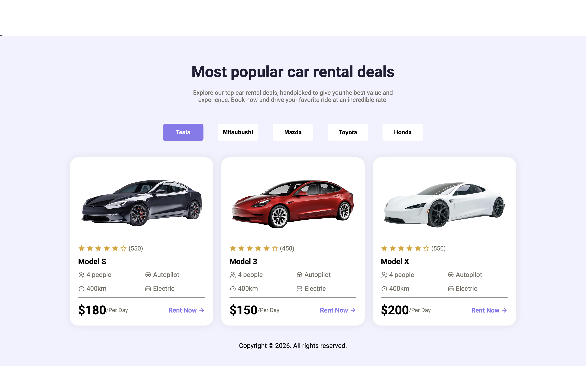

# 🚗 Responsive Car Showcase Page

<p align="center">
  
  <br>
  <b><a href="https://arafahabiodun.github.io/JavaScriptMastery_responsive_page/">🚀 Live Demo</a></b> | 
  <b><a href="https://github.com">💻 Source Code</a></b>
</p>


A fully responsive, dynamic landing page built to showcase luxury vehicle deals. This project focuses on high-quality UI/UX and mobile-first responsiveness.

## ✨ Features
- **Dynamic Content:** Car deals are rendered dynamically using JavaScript.
- **Mobile-First Design:** Custom Media Queries optimized specifically for **iPhone 13** and modern mobile viewports.
- **Responsive Layout:** A clean, multi-device compatible interface using CSS Flexbox/Grid.
- **Optimized Asset Management:** Properly structured file architecture for seamless GitHub Pages deployment.

## 🛠️ Tech Stack
- **HTML5:** Semantic structure for better SEO and accessibility.
- **CSS3:** Custom styling and advanced media queries.
- **JavaScript (ES6):** Logic for dynamic rendering and interactive elements.

## 🔧 Installation & Setup
1. **Clone the repository:**
   ```bash
   git clone https://github.com.git
   cd JavaScriptMastery_responsive_page
# Now, open the index.html file in your browser to view the site.
